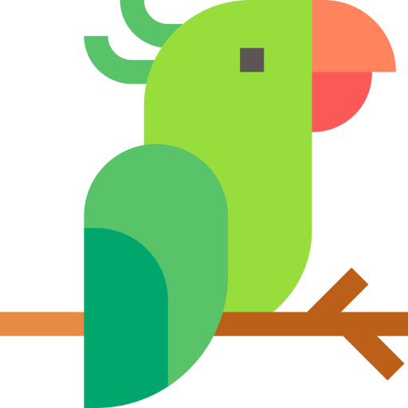

<a name="readme-top"></a>

<!-- PROJECT SHIELDS -->
[![Contributors][contributors-shield]][contributors-url]
[![Forks][forks-shield]][forks-url]
[![Stargazers][stars-shield]][stars-url]
[![Issues][issues-shield]][issues-url]

<!-- PROJECT LOGO -->
<br />
<div align="center">
  <a href="https://github.com/BarshaR/parot">
    
  </a>

<h3 align="center">Parot</h3>

  <p align="center">
    Record, proxy and replay HTTP requests - kind of like a parrot.
    <br />
    <a href="https://github.com/BarshaR/parot/issues">Report Bug</a>
    ·
    <a href="https://github.com/BarshaR/parot/issues">Request Feature</a>
  </p>
</div>

<!-- TABLE OF CONTENTS -->
<details>
  <summary>Table of Contents</summary>
  <ol>
    <li>
      <a href="#about-the-project">About The Project</a>
    </li>
    <li>
      <a href="#getting-started">Getting Started</a>
      <ul>
        <li><a href="#prerequisites">Prerequisites</a></li>
        <li><a href="#installation">Installation</a></li>
      </ul>
    </li>
    <li><a href="#usage">Usage</a></li>
    <li><a href="#roadmap">Roadmap</a></li>
    <li><a href="#contributing">Contributing</a></li>
    <li><a href="#license">License</a></li>
    <li><a href="#contact">Contact</a></li>
    <li><a href="#acknowledgments">Acknowledgments</a></li>
  </ol>
</details>

<!-- ABOUT THE PROJECT -->
## About The Project

Parot is a forwarding proxy which records the requests that come through in real time. It can then replay the recording as needed - retaining time between each request.

The idea of Parot originated from the idea that live production data makes awesome test data. The ability to record a live data flow between HTTP services and replay it afterwards as needed allows you to simulate production like behaviour within a test harness.

<!-- GETTING STARTED -->
## Getting Started

Parot is written in Go. 

### Prerequisites

* Go 1.19.2

### Installation

1. Install Go via the [docs](https://go.dev/doc/install)
2. Clone the repo
   ```sh
   git clone https://github.com/BarshaR/parot.git
   ```
3. Install NPM packages
   ```sh
   go run main.go
   ```

<!-- USAGE EXAMPLES -->
## Usage

TBC


<!-- CONTRIBUTING -->
## Contributing

Contributions are what make the open source community such an amazing place to learn, inspire, and create. Any contributions you make are **greatly appreciated**.

If you have a suggestion that would make this better, please fork the repo and create a pull request. You can also simply open an issue with the tag "enhancement".
Don't forget to give the project a star! Thanks again!

1. Fork the Project
2. Create your Feature Branch (`git checkout -b feature/AmazingFeature`)
3. Commit your Changes (`git commit -m 'Add some AmazingFeature'`)
4. Push to the Branch (`git push origin feature/AmazingFeature`)
5. Open a Pull Request

<!-- LICENSE -->
## License

Distributed under the MIT License. See `LICENSE.txt` for more information.

<!-- CONTACT -->
## Contact

Project Link: [https://github.com/BarshaR/parot](https://github.com/BarshaR/parot)

<p align="right">(<a href="#readme-top">back to top</a>)</p>

<!-- MARKDOWN LINKS & IMAGES -->
<!-- https://www.markdownguide.org/basic-syntax/#reference-style-links -->
[contributors-shield]: https://img.shields.io/github/contributors/BarshaR/parot.svg?style=for-the-badge
[contributors-url]: https://github.com/BarshaR/parot/graphs/contributors
[forks-shield]: https://img.shields.io/github/forks/BarshaR/parot.svg?style=for-the-badge
[forks-url]: https://github.com/BarshaR/parot/network/members
[stars-shield]: https://img.shields.io/github/stars/BarshaR/parot.svg?style=for-the-badge
[stars-url]: https://github.com/BarshaR/parot/stargazers
[issues-shield]: https://img.shields.io/github/issues/BarshaR/parot.svg?style=for-the-badge
[issues-url]: https://github.com/BarshaR/parot/issues
[license-shield]: https://img.shields.io/github/license/BarshaR/parot.svg?style=for-the-badge
